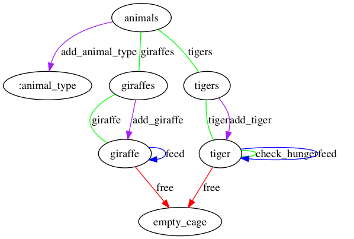

# pica
proof of concept hypermedia generator

## notes

basic goal of app:

representations (hypermedia json fixtures) -> resource based app / graph dot

## usage

to regenerate graph image:

`dot -Tpng examples/zoo/zoo.dot -o examples/zoo/zoo.png`

to regenerate app, from within `examples/`

`../pica g zoo/representations/ zoo`
